# PR0101. Preparación del entorno

## Fase 0: Arranque del Laboratorio en AWS Academy

1. Accede a tu curso de AWS Academy Canvas y entra en Learner Lab

    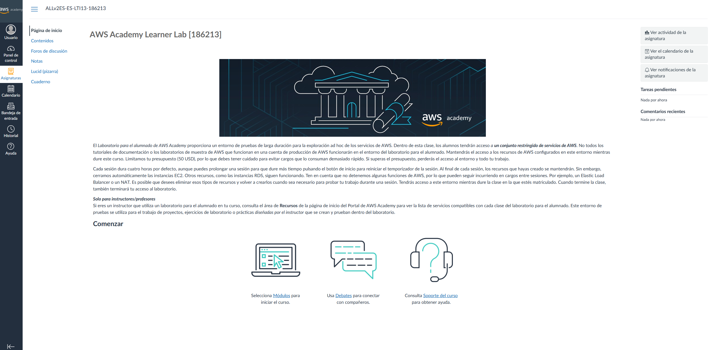

2. Haz clic en el botón Start Lab. Espera a que el círculo junto a “AWS” pase de rojo/amarillo a verde

    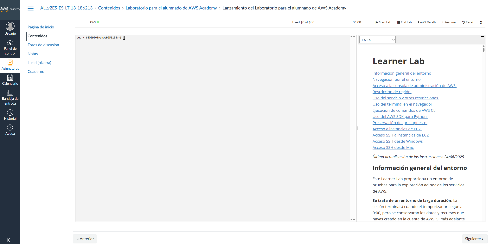

3. Localiza dos botones clave en la barra superior:
   - AWS: Al pulsarlo, abre la Consola de Administración de AWS en una pestaña nueva.

        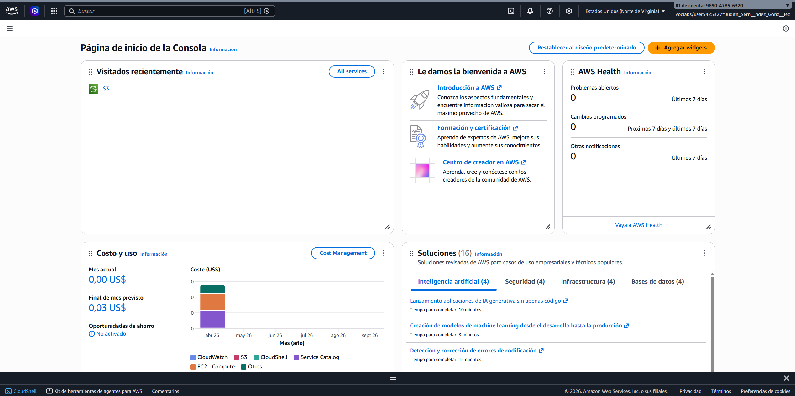

   - AWS Details: Al pulsarlo, muestra la pestaña con tus credenciales temporales (aws_access_key_id, aws_secret_access_key y aws_session_token). Las necesitaremos en la Fase 3.

        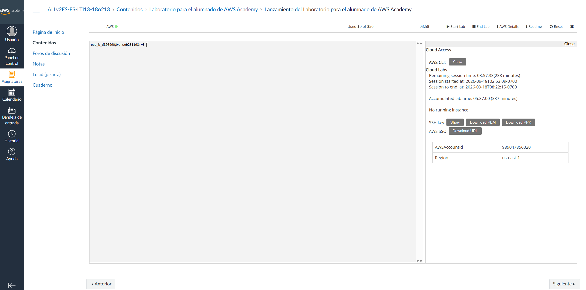

## Fase 1: Interacción mediante la consola Web (GUI)

1. Pulsa sobre el botón AWS en Learner Lab para entrar en la consola web. Comprueba en la esquina superior derecha que la región seleccionada es N. Virginia (us-east-1).

    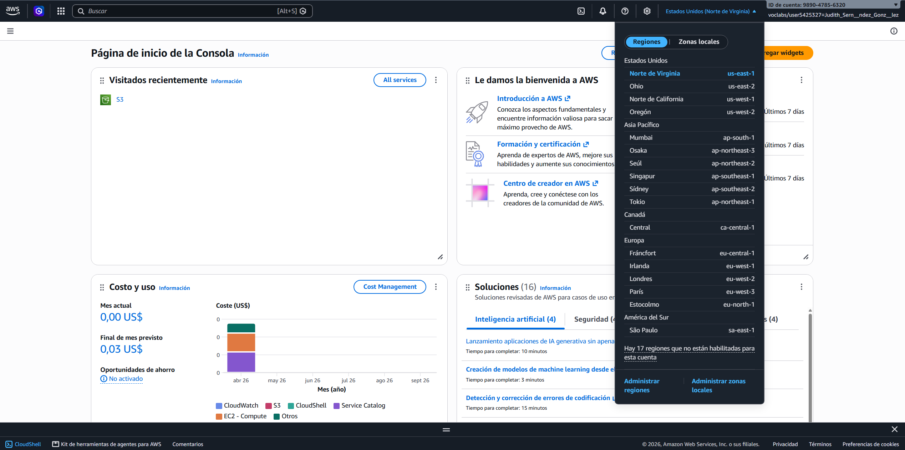

2. En el buscador superior, escribe S3 y selecciona el servicio.

    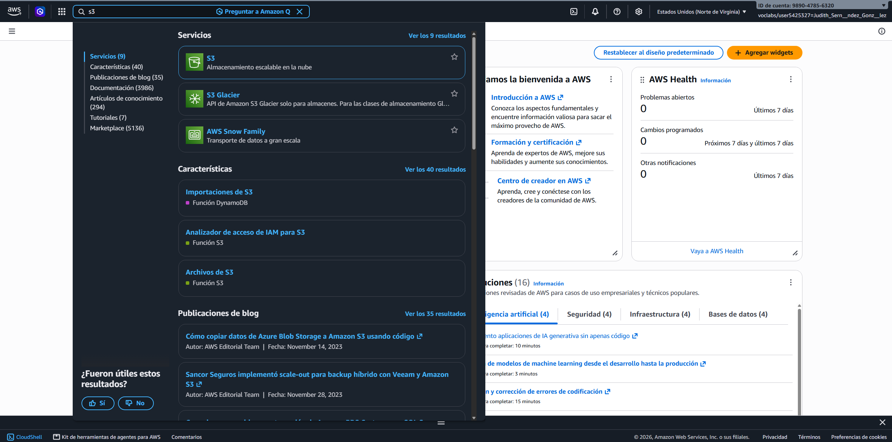

3. Crear el bucket:

 - Pulsa en Create bucket (Crear bucket)

 - Nombre del bucket: asir-[tunombre]-web (ej: asir-juan-web)

 - Mantén las opciones por defecto

 - Haz clic en Create bucket al final de la página

    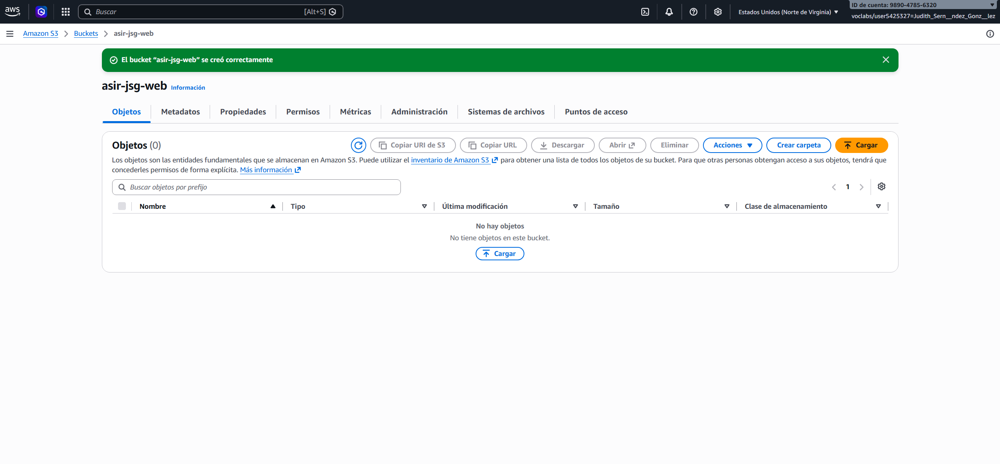

4. Subir un fichero:
 - Entra en el bucket recién creado.
 - Crea en tu equipo un archivo de texto llamado bienvenida-gui.txt con el texto “Creado desde la interfaz web”.
 - Pulsa en Upload (Cargar) -> Add files (Añadir archivos), selecciona el archivo y pulsa Upload.

    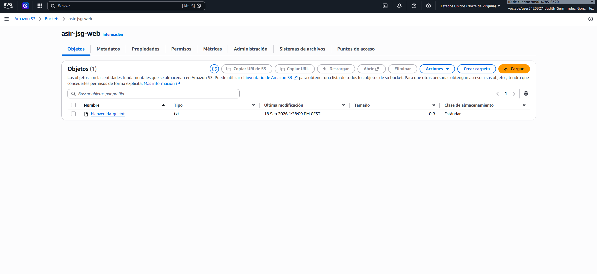

## Fase 2: Interacción mediante CLI con AWS CloudShell

1. En la consola de AWS (barra superior derecha, al lado del icono de notificaciones), haz clic en el icono de CloudShell (>_). Espera unos segundos a que inicialice el entorno Linux.

2. Comprueba la identidad con la que estás ejecutando comandos:
    -  aws sts get-caller-identity

3. Crea un nuevo bucket mediante CLI:
    - aws s3 mb s3://asir-[tunombre]-cli --region us-east-1

4. Genera un archivo en la terminal y súbelo a S3:
    - echo "Hola AWS CLI desde CloudShell" > mensaje-cli.txt
    - aws s3 cp mensaje-cli.txt s3://asir-[tunombre]-cli/

5. Lista los objetos del bucket para verificar la subida:
    - aws s3 ls s3://asir-[tunombre]-cli/

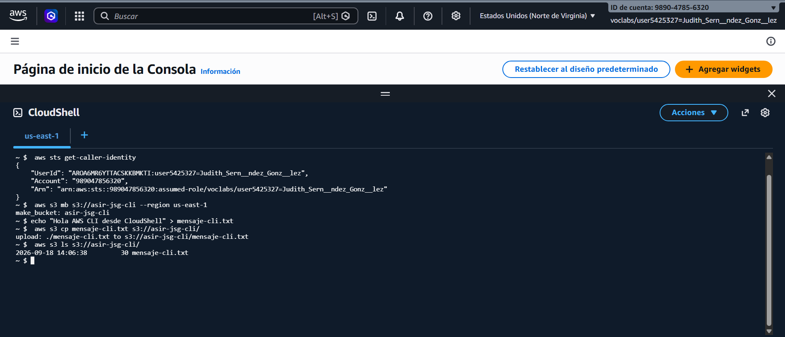
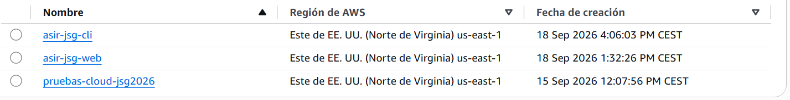
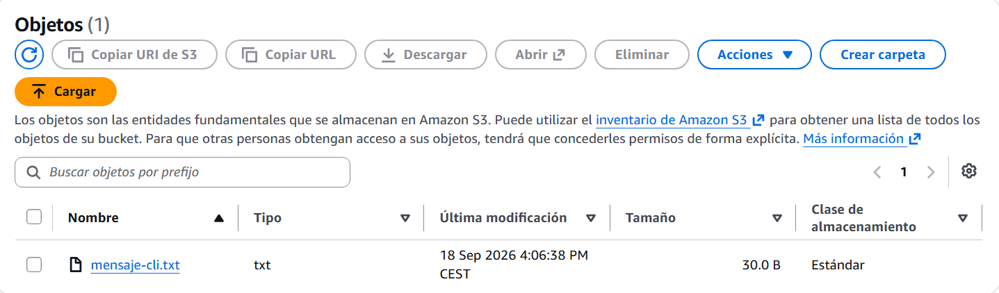
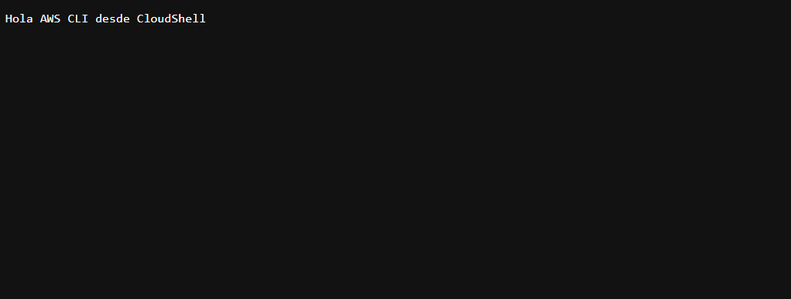

## Fase 3: Interacción mediante SDK con Python (Boto3) en Docker

### Despliegue de Jupyter con Docker Compose

1. En tu máquina del aula, crea una carpeta de trabajo y accede a ella:
- mkdir practica-aws && cd practica-aws
- mkdir notebooks
2. Obtén el fichero docker-compose.yml del repositorio de ficheros compose
3. Levanta el contenedor en segundo plano:
- docker compose up -d
4. Abre tu navegador y entra en: http://localhost:8888.

### Script en Python con Boto3

1. Dentro de JupyterLab, entra en la carpeta work y crea un nuevo Notebook de Python 3.

2. Instalar el SDK: En la primera celda del notebook, instala la librería boto3:

```python
!pip install boto3
```


1. Obtener las credenciales:
Vuelve a la pestaña de Learner Lab en Canvas.
Pulsa en AWS Details y haz clic en Show junto a AWS CLI.
Verás tres valores: aws_access_key_id, aws_secret_access_key y aws_session_token.

1. Ejecutar el script de conexión y subida:

    Copia el siguiente código en una celda de Jupyter sustituyendo las credenciales y tu nombre:

```python
import boto3

# 1. Credenciales temporales de AWS Academy Learner Lab
AWS_ACCESS_KEY = "PEGA_AQUI_TU_AWS_ACCESS_KEY_ID"
AWS_SECRET_KEY = "PEGA_AQUI_TU_AWS_SECRET_ACCESS_KEY"
AWS_SESSION_TOKEN = "PEGA_AQUI_TU_AWS_SESSION_TOKEN"
REGION = "us-east-1"

# 2. Inicializar el cliente de S3
s3_client = boto3.client(
    's3',
    aws_access_key_id=AWS_ACCESS_KEY,
    aws_secret_access_key=AWS_SECRET_KEY,
    aws_session_token=AWS_SESSION_TOKEN,
    region_name=REGION
)

# 3. Crear el bucket
bucket_name = "asir-tunombre-sdk"  # Reemplaza 'tunombre'
s3_client.create_bucket(Bucket=bucket_name)
print(f"Bucket '{bucket_name}' creado con éxito.")

# 4. Crear un archivo local y subirlo al bucket
archivo_local = "datos_sdk.txt"
with open(archivo_local, "w") as f:
    f.write("Archivo subido mediante Python y Boto3 desde Jupyter en Docker.")

s3_client.upload_file(archivo_local, bucket_name, "datos_sdk.txt")
print(f"Archivo '{archivo_local}' subido correctamente.")

# 5. Listar objetos del bucket para confirmar
respuesta = s3_client.list_objects_v2(Bucket=bucket_name)
print("\nObjetos en el bucket:")
for obj in respuesta.get('Contents', []):
    print(f" - {obj['Key']} ({obj['Size']} bytes)")
```
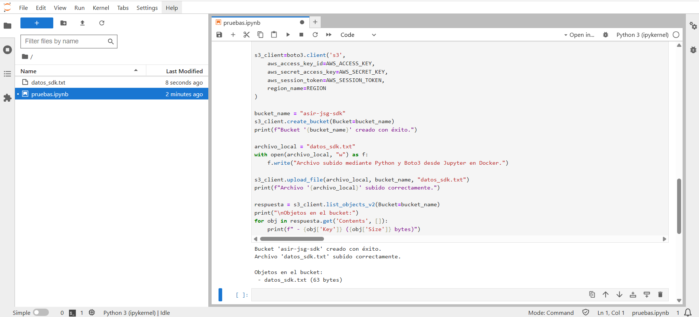
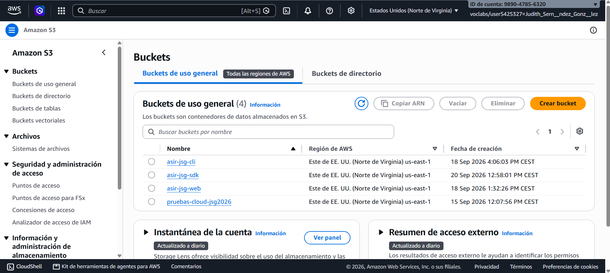

## Fase 4: Tarea final y limpieza de recursos

Una buena práctica en administración cloud es evitar costes y uso innecesario de almacenamiento:

1. Vaciar y borrar los 3 buckets: puedes hacerlo desde la consola web.
2. Detener el entorno:
    - En tu terminal local: docker compose down
    - En AWS Academy Canvas: pulsa en Stop Lab para pausar el contador de créditos.

## Conclusión

¿En qué casos de administración de sistemas recomendarías usar la consola web, en cuáles la CLI y cuándo recurrir a un script con SDK?
```python
Yo usaría la consola web para tareas sencillas y cuando quiero tener una interfaz gráfica más fácil de manejar.

La CLI la usaría para tareas rápidas, repetitivas o cuando necesito más control sobre el sistema.

Y recurriría a un script con SDK cuando tenga que automatizar muchas tareas o gestionar varios sistemas a la vez.
```
