# pr0203

## 1. Contexto

Una consultora tecnológica gestiona repositorios de documentación legal y copias de seguridad de bases de datos. La empresa ha sufrido incidentes recientes de sobreescritura accidental y borrado no autorizado de ficheros. Además, la factura mensual de almacenamiento en la nube ha crecido de forma descontrolada debido a la retención indefinida de versiones obsoletas en la clase de almacenamiento estándar.

Como administradores de sistemas en prácticas, debéis diseñar e implementar una arquitectura de almacenamiento en Amazon S3 que garantice:

- Resiliencia y recuperación ante desastres: recuperación garantizada ante borrados accidentales, modificaciones erróneas o ataques de tipo ransomware.
- Gobierno del dato y reducción de costes: transición automatizada de datos a niveles de almacenamiento frío y purga de versiones antiguas no utilizadas.

## 2. Requisitos Previos y Restricciones Técnicas

- Iniciar la sesión de AWS Academy Learner Lab y abrir la consola en la región asignada (por defecto us-east-1).
- Abrir AWS CloudShell desde la barra superior de la consola o acceder vía EC2 Instance Connect a una máquina Linux con el rol LabRole asignado.
- Nomenclatura de buckets: Los nombres de bucket en S3 son únicos a nivel global. Usad el formato: asir-[iniciales]-[año]-storage (ejemplo: asir-vjg-2026-storage).

## 3. Desarrollo de la práctica

En esta práctica deberás utilizar la siguiente nomenclatura para los nombres de los buckets: asir-[iniciales]-[año]-storage (ejemplo: asir-vjg-2026-storage). En esta práctica se indican las instrucciones para realizar cada paso desde la interfaz de comandos (AWS Cloud Shell o AWS CLI), aunque también puedes realizarla desde la interfaz gráfica.

### Fase 1: Creación del repositorio y activación de versionado

1. Creación del bucket: crea el bucket manteniendo activado el bloqueo total de acceso público.

    ```pyton
    aws s3 mb s3://asir-alumno-2026-storage
    ```

2. Activación de versionado: habilita el versionado en el bucket mediante la CLI o la pestaña Propiedades de la consola:

    ```python
    aws s3api put-bucket-versioning \
    --bucket asir-alumno-2026-storage \
    --versioning-configuration Status=Enabled
    ```

3. Verificación: comprueba el estado del versionado:

    ```python
    aws s3api get-bucket-versioning --bucket asir-alumno-2026-storage
    ```

    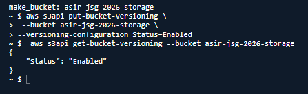

### Fase 2: Simulación de sobreescritura y recuperación de versiones

1. Generación y carga de la primera versión: crea un fichero local contrato_sla.txt con el texto "Versión 1.0 - SLA 99.0%" y súbelo a S3:

    ```python
    echo "Versión 1.0 - SLA 99.0%" > contrato_sla.txt
    aws s3 cp contrato_sla.txt s3://asir-alumno-2026-storage/contratos/contrato_sla.txt
    ```

    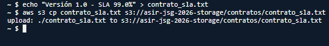

2. Sobreescritura accidental: modifica el fichero local simulando un error ("Versión 2.0 - SLA 90.0% CORRUPTO") y vuelve a subirlo con el mismo nombre y ruta en el bucket.

    ```python
    echo "Versión 2.0 - SLA 90.0% CORRUPTO" > contrato_sla.txt
    aws s3 cp contrato_sla.txt s3://asir-alumno-2026-storage/contratos/contrato_sla.txt
     ```

    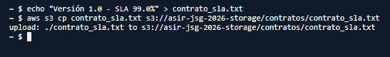

3. Inspección de versiones: lista los identificadores únicos (VersionId) asociados al objeto:

    ```python
    aws s3api list-object-versions \
    --bucket asir-alumno-2026-storage \
    --prefix contratos/contrato_sla.txt \
    --query "Versions[].{VersionId:VersionId, Modificado:LastModified, EsActual:IsLatest}" \
    --output table
    ```

    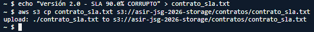

4. Recuperación de la versión original: descarga explícitamente la VersionId correspondiente a la versión 1.0 para verificar que la información original sigue intacta.

    ```python
        aws s3api get-object \
        --bucket asir-alumno-2026-storage \
        --key contratos/contrato_sla.txt \
        --version-id "PEGAR_AQUI_EL_VERSION_ID_V1" \
        contrato_recuperado.txt
        cat contrato_recuperado.txt
    ```

    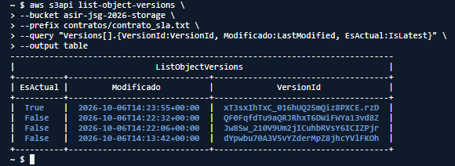

### Fase 3: Simulación de borrado y análisis de marcas de borrado

1. Borrado simple del objeto: ejecuta un comando de borrado estándar. Después comprueba el contenido del bucket con aws s3 ls s3://asir-alumno-2026-storage/contratos/. El fichero aparentemente ha desaparecido.:

    ```python
    aws s3 rm s3://asir-alumno-2026-storage/contratos/contrato_sla.txt
    ```

2. Auditoría forense con list-object-versions: ejecuta el listado exhaustivo para localizar los Delete Markers:

    ```python
    aws s3api list-object-versions \
    --bucket asir-alumno-2026-storage \
    --prefix contratos/contrato_sla.txt \
    --query "DeleteMarkers[].{VersionId:VersionId, EsActual:IsLatest}" \
    --output table
    ```

3. Restauración del objeto: elimina el Delete Marker indicando su VersionId específico.

    ```python
    aws s3api delete-object \
    --bucket asir-alumno-2026-storage \
    --key contratos/contrato_sla.txt \
    --version-id "PEGAR_AQUI_EL_VERSION_ID_DEL_DELETE_MARKER"
    ```

4. Verificación: vuelve a ejecutar aws s3 ls. El fichero debe reaparecer automáticamente como objeto activo.

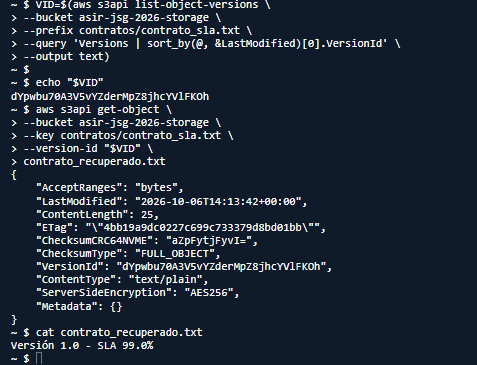

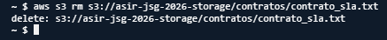

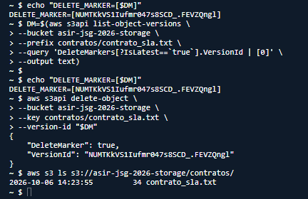

### Fase 4: Configuración de políticas de ciclo de vida (Lifecycle Rules)

Implementa una directiva corporativa que regule dos prefijos diferentes dentro del bucket (recuerda que los prefijos equivalen a las carpetas en S3):

- Prefijo backups/: archivos pesados que deben transicionar rápido a almacenamiento frío.
- Prefijo documentacion/: archivos de consulta habitual que requieren retención histórica pero depuración de versiones obsoletas.

Crear el fichero local lifecycle_policy.json con la siguiente definición técnica:

 ```python
{
  "Rules": [
    {
      "ID": "PoliticaArchivadoBackups",
      "Filter": {
        "Prefix": "backups/"
      },
      "Status": "Enabled",
      "Transitions": [
        {
          "Days": 30,
          "StorageClass": "STANDARD_IA"
        },
        {
          "Days": 90,
          "StorageClass": "GLACIER"
        }
      ],
      "Expiration": {
        "Days": 365
      }
    },
    {
      "ID": "GestionVersionesDocumentacion",
      "Filter": {
        "Prefix": "documentacion/"
      },
      "Status": "Enabled",
      "NoncurrentVersionTransitions": [
        {
          "NoncurrentDays": 30,
          "StorageClass": "GLACIER"
        }
      ],
      "NoncurrentVersionExpiration": {
        "NoncurrentDays": 90
      },
      "AbortIncompleteMultipartUpload": {
        "DaysAfterInitiation": 7
      }
    }
  ]
}
 ```

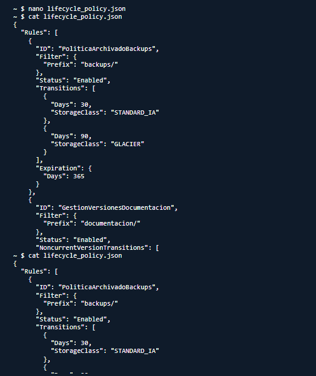

1. Aplica la directiva:

    ```python
    aws s3api put-bucket-lifecycle-configuration \
    --bucket asir-alumno-2026-storage \
    --lifecycle-configuration file://lifecycle_policy.json
    ```

    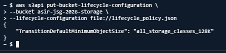

2. Valida la directiva aplicada:

    ```python
    aws s3api get-bucket-lifecycle-configuration --bucket asir-alumno-2026-storage
    ```

    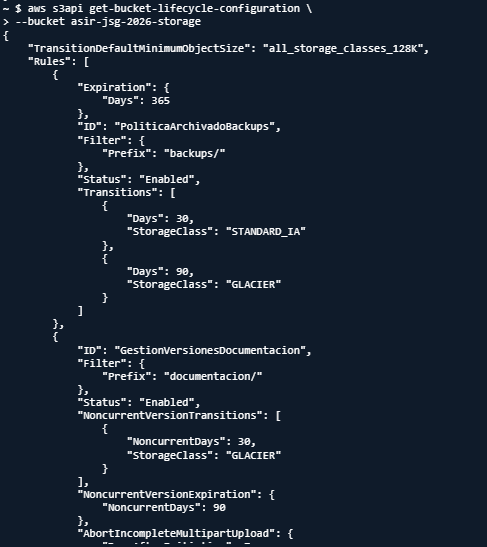

3. Comprobación visual: Accede a la consola web de AWS -> S3 -> Su bucket -> Pestaña Management y verifica cómo se representan gráficamente las transiciones y expiraciones.

    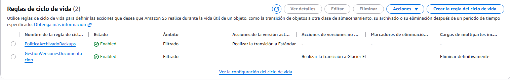

### Fase 5: Estudio económico y comparativa de costes

Para justificar técnicamente la política ante el departamento financiero, debes cumplimentar la siguiente tabla comparativa utilizando los precios vigentes de la región us-east-1 (consulta la página oficial de tarifas de AWS S3) y responde a las cuestiones planteadas:

| Clase de Almacenamiento | Coste aprox. ($/GB/mes) | Tiempo mínimo de facturación | Tamaño mínimo facturable | Tiempo de recuperación (Retrieval) |
| --- | --- | --- | --- | --- |
| **S3 Standard** | $0.023 | Ninguno | Ninguno | Inmediato (milisegundos) |
| **S3 Standard-IA** | $0.0125 | 30 días | 128 KB | Inmediato (ms) |
| **S3 Glacier Flexible Retrieval** | $0.0036 | 90 días | 40 KB de metadatos/objeto* | 1 min – 12 h |
| **S3 Glacier Deep Archive** | $0.00099 | 180 días | 40 KB de metadatos/objeto* | 9 – 48 h |

* En Glacier Flexible Retrieval y Deep Archive, AWS añade 40 KB de metadatos por objeto: 8 KB se facturan como Standard y 32 KB como la clase Glacier

Preguntas de análisis:

1. Riesgo de microficheros en clases IA/Glacier: si una aplicación sube 500.000 ficheros de log de 2 KB cada uno a S3 Standard-IA, ¿por qué aumentaría la factura en lugar de reducirse?

    S3 Standard-IA tiene un tamaño mínimo facturable de 128 KB por objeto. Aunque cada fichero solo tenga 2 KB, AWS cobra como mínimo 128 KB.

    500.000 archivos × 128 KB = 64.000.000 KB
    64 GB facturables

    Aunque los archivos realmente ocupen 1GB:
    500.000 × 2 KB = 1.000.000 KB ≈ 1 GB

    Estarías pagando aproximadamente por 64 GB en lugar de 1 GB, además de que Standard-IA tiene una permanencia mínima de 30 días.

2. Borrado prematuro: si un script de backup elimina un fichero de 10 GB en S3 Glacier Flexible Retrieval solo 15 días después de haberlo subido, ¿cuántos días adicionales cobrará AWS en concepto de penalización por borrado temprano?

    AWS cobraría los 75 días restantes hasta completar el periodo mínimo de almacenamiento de 90 días.

    90 − 15 = 75 días

    No significa necesariamente que haya una "multa" fija, sino que se aplica un cargo prorrateado por los 75 días restantes.

3. Cálculo de ahorro: una empresa almacena 20 TB de copias de seguridad estáticas que casi nunca se leen. ¿Cuánto pagaría al mes en S3 Standard frente a mantenerlas en S3 Glacier Flexible Retrieval?

    S3 Standard
    Precio: 20.000 GB × $0.023 = $460/mes

    Glacier Flexible Retrieval
    Precio: 20.000 GB × $0.0036 = $72/mes

    Porcentaje de ahorro:
    388 / 460 × 100 ≈ 84,3 %
